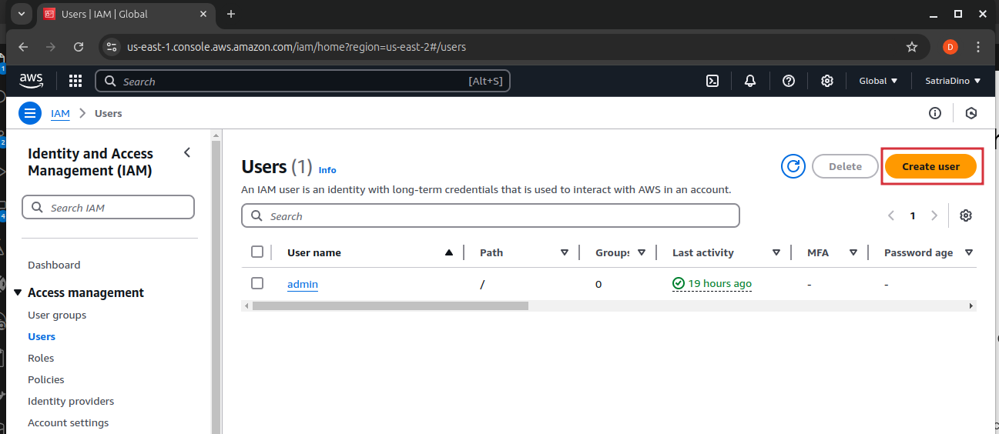
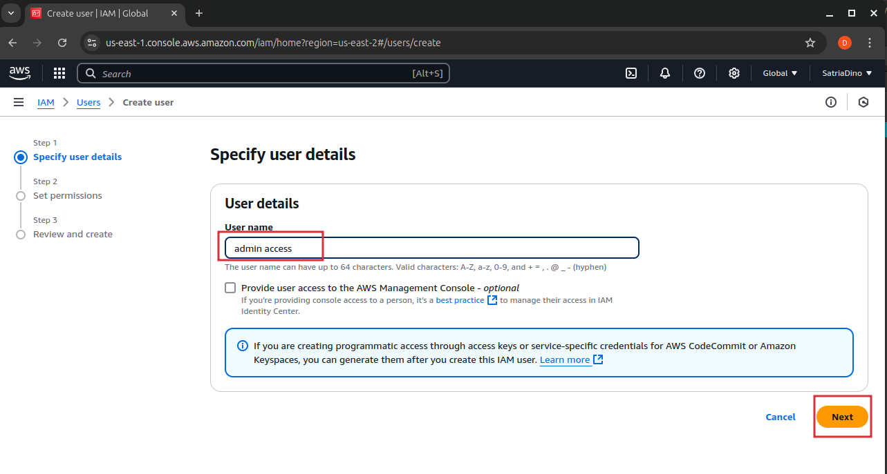
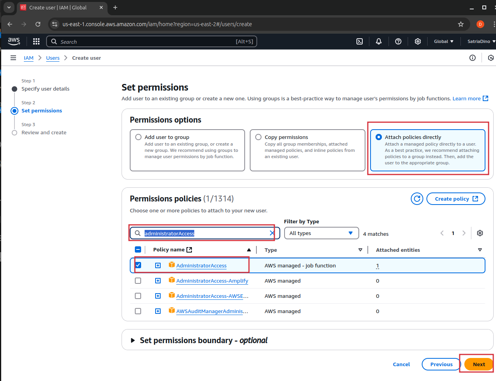
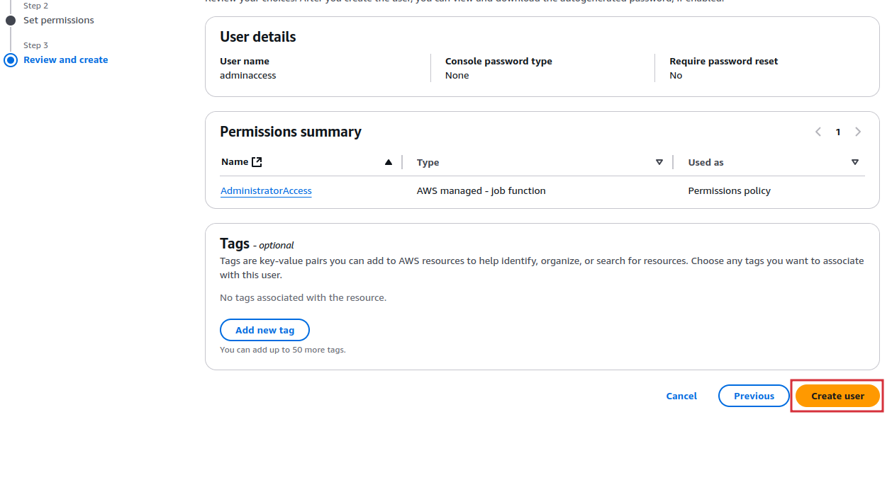
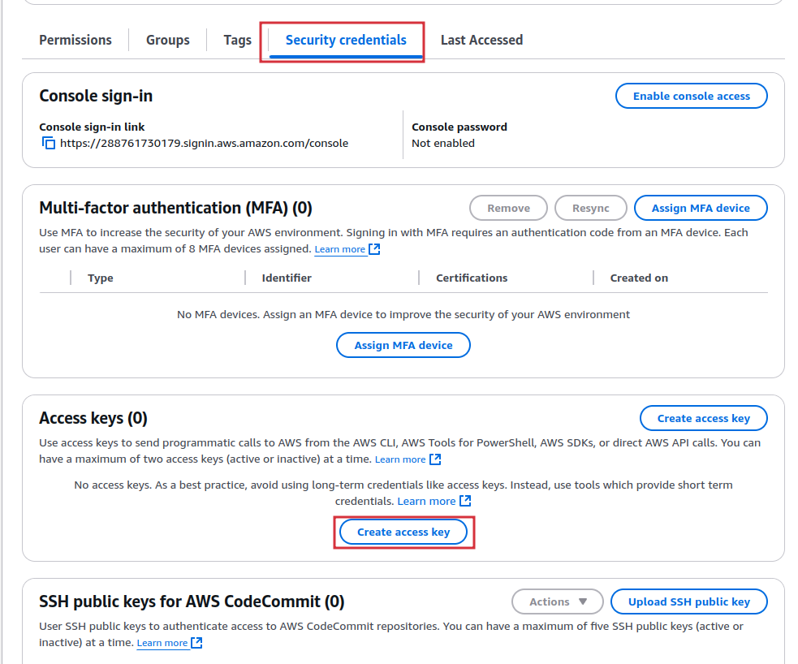
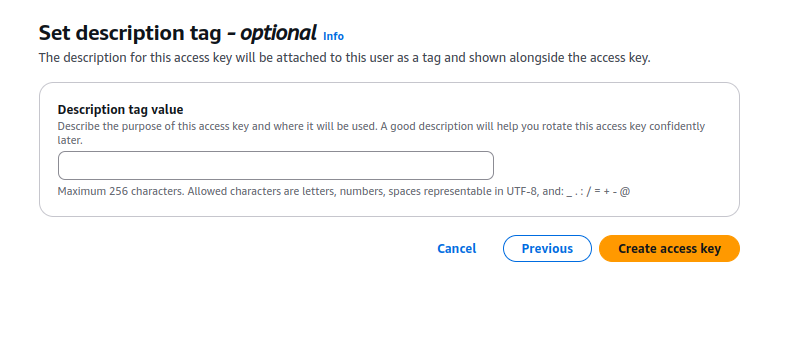

# AWS Iprotate Python

## Requirement

- **Router VPS**
  - Minimal ram 2GB
  - 1 Core vcpu
  - 200mbps outbound Internet
- **Aws Free Tier Account**
  - Security Credentials Access Key Created with "AdministratorAccess" Permission

## Prerequisites

- Creating AWS Security Credentials Access Key
  - open IAM Dashboard on AWS Console
    
  - Click on Users and on Create user
    
  - Fill the user name field and click next
    
  - Select Attach policies directly option and search for "AdministratorAccess",  
    select permission policies "AdministratorAccess" from the dropdown and then click next
    
  - Click Create user
    
  - Click on username that just created
    
  - Select Security details tab and scrolldown on Access keys section then click Create access key
    
  - select Command Line Interface (CLI), Check the checkbox and then click Next
    
  - Set description (optional) tag we can set a tag for the access key or set none then,  
    click Create access key
    
  - Set description (optional) tag we can set a tag for the access key or set none then,  
    click Create access key
    
  - **PLEASE BE CAREFULL** on this part, on this page we can retrive the access key only this time  
    if we click next, we can't retrive this key and have to create a new one  
    copy the Access key and Secret access key and store it on note or text file so we can use it later  
    after that you can click done
    

## Setup Process

generate open ssh key and copy it to your VPS.  
Connect to your VPS login as root and follow the command below

- Update Package list
  ```bash
  apt update -y
  ```
- Install software, packages & dependencies
  ```bash
  apt install wireguard python3 -y
  apt install -y python3-pip python3-venv ufw pkg-config \
  software-properties-common lsb-release build-essential \
  libssl-dev cmake libdbus-1-dev glibc-tools npm net-tools
  ```
- Install glib2.0
  ```bash
  apt-get install -y glib2.0
  ```
- Install shadowsocks
  ```bash
  sudo curl https://raw.githubusercontent.com/ilyasbit/ss-easy-setup/main/install-only.sh | sudo bash -s
  ```
- Install 3proxy
  ```bash
  git clone https://github.com/z3apa3a/3proxy
  cd 3proxy
  ln -s Makefile.Linux Makefile
  make
  sudo make install
  ```
- Install PM2
  ```bash
  npm install pm2 -g
  ```
- clone repository aws-iprotate-python
  ```bash
  git clone https://github.com/ilyasbit/aws-iprotate-python.git /opt/cloud-iprotate
  cd /opt/cloud-iprotate
  ```
- Copy service file template and reload systemctl
  ```bash
  cp /opt/cloud-iprotate/iprotate@.service /etc/systemd/system/
  systemctl daemon-reload
  ```
- Generate wireguard keypair
  ```bash
  wg genkey > interface_privatekey
  wg pubkey < interface_privatekey > interface_publickey
  wg genkey > peer_privatekey
  wg pubkey < peer_privatekey > peer_publickey
  ```
- Copy config.conf.example file
  ```bash
  cp config.conf.example config.conf
  ```
- Configure your config file
- Setup python venv and install all requirements module
  ```bash
  python3 -m venv venv --system-site-packages
  source venv/bin/activate
  python -m pip install pip --upgrade
  pip install -r requirements.txt
  ```
- Allow all traffic
  ```bash
  ufw default allow
  ufw enable
  ```
- Start api
  ```bash
  pm2 start app.py --name iprotate --interpreter python
  ```

## Functionalty

- Change ip address

  ```
  ip:port/change_ip?config_name=aws01&apikey=api
  ```

- Change region

  ```
  ip:port/change_region?config_name=aws01&region=us-east-1&apikey=api
  ```

- Change whitelist

  ```
  ip:port/change_whitelist?config_name=aws01&new_whitelist=180.252.29.235&apikey=api
  ```

- Change authentication

  ```
  ip:port/change_auth?config_name=aws01&new_user=ilyas&new_pass=123456&apikey=api
  ```

- Get config & details

  ```
  ip:port/get_config?config_name=aws01&apikey=api
  ```

- Get all task

  ```
  ip:port/get_task?apikey=api
  ```

- Reset Config on Config name

  ```
  ip:port/reset?config_name=aws01&apikey=api
  ```
